# Architecture Diagram v2

## System Architecture Overview

```mermaid
graph TB
    subgraph "Client Layer"
        UI[React + Vite<br/>Lovable Cloud<br/>TLS 1.3]
    end

    subgraph "Ingress & Security"
        LB[Load Balancer<br/>CloudFront CDN<br/>Rate Limit: 100 req/min/IP]
        WAF[WAF<br/>Block Suspicious Uploads]
        AUTH[Auth Service<br/>Lovable Cloud / Auth0<br/>JWT: 15min expiry]
    end

    subgraph "API Layer"
        API1[Flask API v2.3<br/>Python 3.11<br/>Instance 1]
        API2[Flask API v2.3<br/>Python 3.11<br/>Instance 2]
        API3[Flask API v2.3<br/>Python 3.11<br/>Instance 3]
    end

    subgraph "Queue Layer"
        RMQ1[RabbitMQ 3.12<br/>Node 1<br/>Priority Queues]
        RMQ2[RabbitMQ 3.12<br/>Node 2<br/>Mirrored Queues]
        RMQ3[RabbitMQ 3.12<br/>Node 3<br/>DLQ]
    end

    subgraph "Worker Layer"
        W1[Frame Extractor<br/>Celery Worker<br/>CPU: c5.2xlarge<br/>FFmpeg 6.0 + GPU]
        W2[AI Detector<br/>Celery Worker<br/>GPU: g4dn.xlarge]
        W3[Video Compositor<br/>Celery Worker<br/>GPU: g4dn.xlarge]
        W4[Auto-scaling Pool<br/>2-20 instances<br/>K8s HPA]
    end

    subgraph "External Services"
        GV[Google Vision API v1<br/>Batch: 10 frames/req<br/>Fallback: NudeNet<br/>Circuit Breaker]
        WHISPER[OpenAI Whisper API<br/>or Local Model<br/>Latency: <2s]
        S3[AWS S3<br/>Pre-signed URLs<br/>1hr expiry<br/>Lifecycle: 7-30 days]
    end

    subgraph "Data Layer"
        REDIS[Redis 7.0+<br/>ElastiCache<br/>Cache + Broker<br/>AUTH enabled]
        PG[PostgreSQL 15+<br/>RDS<br/>pgvector extension<br/>RLS enabled<br/>TDE encryption]
        PG_REPLICA[PostgreSQL Read Replica<br/>pgBouncer Pool: 50]
    end

    subgraph "Observability"
        CW[CloudWatch Logs<br/>Structured JSON]
        METRICS[Prometheus + Grafana<br/>P50/P95/P99 Latency]
        TRACE[OpenTelemetry<br/>Distributed Tracing]
    end

    %% Client to Ingress
    UI -->|HTTPS| LB
    LB --> WAF
    WAF --> AUTH

    %% Auth to API
    AUTH -->|JWT Validation| API1
    AUTH -->|JWT Validation| API2
    AUTH -->|JWT Validation| API3

    %% API to Queue
    API1 -->|Upload Job| RMQ1
    API2 -->|Upload Job| RMQ1
    API3 -->|Upload Job| RMQ1
    RMQ1 -.->|Mirror| RMQ2
    RMQ1 -.->|DLQ| RMQ3

    %% Queue to Workers
    RMQ1 -->|Job Queue| W1
    RMQ1 -->|Job Queue| W2
    RMQ1 -->|Job Queue| W3
    RMQ1 -->|Auto-scale| W4

    %% Workers to External Services
    W1 -->|Extract Frames<br/>Latency: <12s| GV
    W1 -->|Upload Video<br/>Pre-signed URL<br/>Latency: <8s| S3
    W2 -->|Batch API Calls<br/>10 frames/req<br/>Latency: <6s| GV
    W2 -->|Transcribe Audio<br/>Latency: <2s| WHISPER
    W3 -->|Download + Compose<br/>GPU Encoding<br/>Latency: <8s| S3
    W3 -->|Export Video<br/>Multipart Upload<br/>Latency: <5s| S3

    %% Workers to Data Layer
    W1 -->|Cache Status| REDIS
    W2 -->|Cache Status| REDIS
    W3 -->|Cache Status| REDIS
    W1 -->|Write Metadata| PG
    W2 -->|Write Detection Results| PG
    W3 -->|Update Job Status| PG
    API1 -->|Read Status| REDIS
    API2 -->|Read Status| REDIS
    API3 -->|Read Status| REDIS
    API1 -->|Read Profiles| PG_REPLICA
    API2 -->|Read Profiles| PG_REPLICA
    API3 -->|Read Profiles| PG_REPLICA

    %% Observability
    API1 -.->|Logs| CW
    API2 -.->|Logs| CW
    API3 -.->|Logs| CW
    W1 -.->|Metrics| METRICS
    W2 -.->|Metrics| METRICS
    W3 -.->|Metrics| METRICS
    RMQ1 -.->|Queue Depth| METRICS
    API1 -.->|Traces| TRACE
    W1 -.->|Traces| TRACE
    W2 -.->|Traces| TRACE

    %% Styling
    classDef security fill:#ffcccc,stroke:#ff0000,stroke-width:2px
    classDef external fill:#cce5ff,stroke:#0066cc,stroke-width:2px
    classDef data fill:#ccffcc,stroke:#00cc00,stroke-width:2px
    classDef worker fill:#ffffcc,stroke:#ffcc00,stroke-width:2px

    class AUTH,WAF security
    class GV,WHISPER,S3 external
    class REDIS,PG,PG_REPLICA data
    class W1,W2,W3,W4 worker
```



## Data Flow (5-minute video processing)

```
1. CLIENT UPLOAD (8s)
   UI → LB → Auth → API → Pre-signed S3 URL → Client uploads directly to S3
   
2. JOB QUEUE (1s)
   API → RabbitMQ → Celery Worker picks up job
   
3. FRAME EXTRACTION (12s)
   Worker → FFmpeg (GPU) → Extract 150 frames @ 0.5 FPS → S3
   
4. AI DETECTION (6s)
   Worker → Batch 10 frames/request → Google Vision API (15 parallel batches)
   Worker → OpenAI Whisper API → Transcribe audio → Profanity detection
   
5. VIDEO RECONSTRUCTION (8s)
   Worker → Download frames → Apply blur/mute → GPU encoding → S3
   
6. EXPORT (5s)
   Worker → Multipart upload to S3 → CloudFront CDN → User download
   
TOTAL: ~40s (Target: 60s) ✅
```

## Security Boundaries

```
┌─────────────────────────────────────────────────────────┐
│ PUBLIC INTERNET (HTTPS/TLS 1.3 Required)               │
└─────────────────────────────────────────────────────────┘
           ↓
┌─────────────────────────────────────────────────────────┐
│ SECURITY LAYER                                          │
│ • WAF: Block malicious uploads                          │
│ • Rate Limiting: 100 req/min per IP                    │
│ • JWT Validation: 15min expiry                         │
└─────────────────────────────────────────────────────────┘
           ↓
┌─────────────────────────────────────────────────────────┐
│ API LAYER (Authenticated Requests Only)                │
│ • JWT required on all endpoints                        │
│ • File validation: Max 500MB, MP4/WebM only            │
│ • CORS: Only lovable.app domain                        │
└─────────────────────────────────────────────────────────┘
           ↓
┌─────────────────────────────────────────────────────────┐
│ DATA LAYER (Encrypted at Rest)                         │
│ • S3: SSE-S3 encryption                                │
│ • PostgreSQL: TDE for sensitive columns                │
│ • Redis: AUTH password protection                      │
│ • RLS: Users can only access own data                  │
└─────────────────────────────────────────────────────────┘
```

## Failure Points & Fallbacks

| Component | Failure Mode | Detection | Fallback Strategy |
|-----------|--------------|-----------|-------------------|
| **Google Vision API** | API down / Rate limit | Health check every 30s | Circuit breaker → Local NudeNet model |
| **RabbitMQ Node** | Out of memory | CloudWatch alarm >80% | Auto-scale nodes OR migrate to AWS SQS |
| **Celery Worker** | Crash mid-job | Celery timeout (60s) | `task_acks_late=True` → Retry from DLQ |
| **FFmpeg** | Corrupted video | Validate with `ffprobe` | Log to DLQ, retry 3x with backoff |
| **S3 Upload** | Network failure | Check PutObject response | Retry 3x (2s, 4s, 8s), email user |
| **PostgreSQL** | Connection pool exhausted | pgBouncer metrics | Increase pool (20→50), add read replicas |
| **Redis** | Memory full | Eviction policy | Scale up instance size |

## Latency Targets & Actuals

| Stage | Target | Actual (Optimized) | Status |
|-------|--------|-------------------|--------|
| Upload (client → S3) | 10s | 8s | ✅ |
| Frame Extraction | 15s | 12s | ✅ |
| AI Detection | 20s | 6s | ✅ |
| Video Reconstruction | 10s | 8s | ✅ |
| Export (S3 upload) | 5s | 5s | ✅ |
| **Total (5min video)** | **60s** | **39s** | ✅ **Exceeds** |

## Component Versions

| Component | Version | Notes |
|-----------|---------|-------|
| React | 18+ | Frontend framework |
| Vite | 5+ | Build tool |
| Flask | 2.3+ | Backend API |
| Python | 3.11+ | Runtime |
| Celery | 5.3+ | Task queue workers |
| RabbitMQ | 3.12+ | Message broker |
| Redis | 7.0+ | Cache + broker |
| PostgreSQL | 15+ | Database |
| FFmpeg | 6.0+ | Video processing |
| Google Vision API | v1 | AI detection |
| OpenAI Whisper | API v1 | Speech-to-text |

