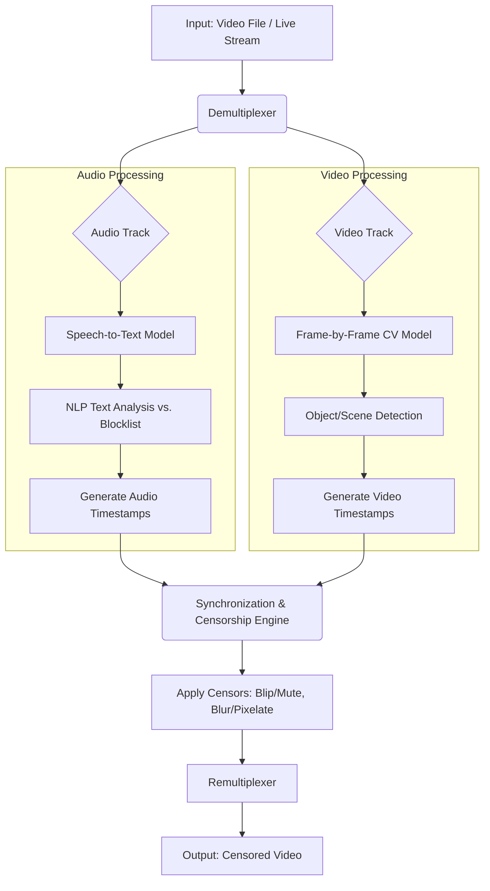

### **Project Proposal: AI Auto Censorer**

## 1\. Problem Statement

Manually censoring inappropriate content in video and audio for different audiences is a **time-consuming, costly, and inconsistent** process. Parents lack effective, customizable tools to filter content for their children in real-time, while television studios and content creators face significant overhead in producing multiple versions of content for various broadcasting standards. An AI-powered system is required to **automatically detect and censor user-defined improper content** (e.g., profanity, graphic violence) in video streams, providing a reliable, efficient, and customizable solution.

## 2\. Target Users

  * **Primary Audience: Parents**
      * **Goal:** To create a safe viewing environment for their children by filtering inappropriate language, violence, and other mature themes from movies, TV shows, and online videos.
  * **Secondary Audience: Television Studios & Streaming Services**
      * **Goal:** To automate the creation of censored versions of content for broadcast television, airline edits, or different regional ratings, thereby reducing manual labor costs and accelerating distribution workflows.

## 3\. Success Criteria

The success of this project will be measured against the following quantitative and qualitative metrics:

  * **Audio Censorship Accuracy:** The speech-to-text and profanity detection model must achieve **\>95% precision** (correctly identifying profanity) and **\>95% recall** (not missing instances of profanity) on a standardized test dataset.
  * **Visual Censorship Accuracy:** The computer vision model must achieve **\>90% accuracy** in identifying predefined categories of visual content (e.g., graphic violence, nudity).
  * **Real-Time Processing Latency:** For live stream processing, the end-to-end delay between video input and censored output must be **less than 400 milliseconds** to ensure a seamless viewing experience.
  * **False Positive Rate:** The system must maintain a false positive rate of **\<2%** for both audio and visual detection to avoid disrupting the user's viewing experience by censoring appropriate content.
  * **User Satisfaction:** Achieve a **System Usability Scale (SUS) score of 80 or higher** from a user study with at least 15 target users.

## 4\. Technical Architecture

The system will be built on a modular pipeline architecture to process video and audio streams independently before synchronizing and applying censorship.

  * **Input Module:** Accepts video files (MP4, AVI, etc.) or a live RTMP stream.
  * **Core Processing Pipeline:**
    1.  **Stream Demultiplexing:** The input video is split into its separate audio and video tracks.
    2.  **Audio Processing Track:**
          * **Speech-to-Text (STT):** An STT model (e.g., **OpenAI's Whisper**) transcribes the audio track into text with precise timestamps.
          * **NLP Analysis:** The transcribed text is compared against a customizable, user-defined blocklist of words and phrases.
          * **Timestamp Generation:** Timestamps for profane words are flagged for censorship.
    3.  **Video Processing Track:**
          * **Frame Analysis:** A Computer Vision model (e.g., a fine-tuned **YOLOv8**) processes video frames to detect inappropriate objects or scenes (e.g., weapons, blood).
          * **Timestamp Generation:** Frame ranges containing inappropriate visuals are flagged for censorship.
  * **Censorship Engine:**
      * This module receives the flagged timestamps from both the audio and video tracks.
      * It applies the user-selected censorship method at the precise moments required:
          * **Audio:** Overlays a "blip" sound or mutes the audio segment.
          * **Video:** Applies a blur, pixelation, or black box over a specific region or the entire frame.
  * **Output Module:** The censored audio and video tracks are re-multiplexed into a final video file or outputted as a clean live stream.
  * **Tech Stack:**
      * **Backend:** Python with FastAPI or Flask.
      * **AI/ML:** PyTorch or TensorFlow.
      * **Key Libraries:** `OpenCV` for video manipulation, `Whisper` for STT, `Transformers` for NLP, and `Pydub` for audio manipulation.
      * **Frontend:** A simple web UI built with React or Vue.js for file uploads and managing custom blocklists.

-----

## 5\. Architecture Diagram

This diagram illustrates the flow of data through the system from input to final censored output.

-----

## 6\. Risk Assessment

| Risk Category | Risk Description | Likelihood | Impact | Mitigation Strategy |
| :--- | :--- | :--- | :--- | :--- |
| **Technical** | **Inaccurate AI Models:** False positives (censoring innocent content) or false negatives (missing inappropriate content) ruin the user experience. | High | High | Use state-of-the-art pre-trained models. Allow users to set a confidence threshold. Implement a feedback loop for users to report errors and help fine-tune the models. |
| **Technical** | **High Latency:** Real-time processing is too slow, causing noticeable lag in live streams. | Medium | High | Optimize models using techniques like quantization. Utilize GPU acceleration. Design an efficient, parallel processing pipeline. |
| **Ethical** | **Algorithmic Bias:** The model, trained on biased data, could disproportionately flag speech or visuals from specific cultures or dialects. | Medium | High | Train and test on diverse datasets. Conduct a bias audit of the models. Be transparent with users about the system's limitations. |
| **Project** | **Scope Creep:** Trying to censor all forms of "inappropriate" content (e.g., complex themes, subtle innuendo) is unfeasible. | High | Medium | Define a very specific and limited initial scope (e.g., English-language profanity list of 100 words and 3 categories of visual violence). Expand only after the core functionality is robust. |

-----

## 7\. Research Plan

| Phase | Duration | Key Activities | Deliverable |
| :--- | :--- | :--- | :--- |
| **1. Research & Tool Selection** | Weeks 1-2 | - Review academic papers on real-time STT and video object detection. - Benchmark performance of models like Whisper, YOLOv8, and ResNet. - Finalize the core technology stack. | A technology selection and justification report. |
| **2. Audio Censorship Prototype** | Weeks 3-6 | - Implement the audio processing pipeline (extract, transcribe, analyze). - Develop the audio "blip" and "mute" functionality. - Test with sample audio clips. | A functional prototype that can censor profane words in an audio file. |
| **3. Visual Censorship Prototype** | Weeks 7-10 | - Fine-tune a pre-trained CV model on a custom dataset. - Implement the video processing pipeline (frame analysis, detection). - Develop the video "blur" and "pixelate" functionality. | A functional prototype that can censor predefined visuals in a video file. |
| **4. System Integration & UI** | Weeks 11-14 | - Merge the audio and video pipelines. - Build a basic web interface for uploading files and managing blocklists. - Conduct end-to-end testing and performance optimization. | The integrated beta version of the AI Auto Censorer application. |
| **5. User Study & Finalization** | Weeks 15-16 | - Recruit participants and conduct the user study. - Analyze feedback and SUS scores. - Make final bug fixes and write the final project report. | A final, tested application and a comprehensive capstone report. |

-----

## 8\. User Study Plan

  * **Objective:** To assess the usability, effectiveness, and user satisfaction of the AI Auto Censorer with its primary target audience.
  * **Participants:** 15 parents who regularly monitor their children's media consumption.
  * **Methodology:** Each participant will engage in a 45-minute remote, moderated session.
    1.  **Introduction (5 min):** Explain the purpose of the study and the tool. Obtain informed consent.
    2.  **Task Scenario (30 min):** Participants will be asked to complete a series of tasks, such as:
          * "Censor this movie clip using the default settings."
          * "The word 'gosh' is not on the default list. Add it to the custom blocklist and re-process the clip."
          * "Change the video censorship style from blur to pixelation."
    3.  **Post-Session Survey (10 min):** Participants will complete the System Usability Scale (SUS) questionnaire and answer open-ended questions about their experience.
  * **IRB Checklist Considerations:**
      * [x] **Informed Consent:** A consent form will detail the study procedures, data handling, and the right to withdraw. It will explicitly warn users they will be exposed to (briefly) uncensored, inappropriate content for testing purposes.
      * [x] **Data Privacy:** All data will be anonymized. Screen recordings will not capture any personal information and will be deleted post-analysis.
      * [x] **Benefit vs. Risk:** The risk (brief exposure to profanity) is minimal and is outweighed by the benefit of improving a parental control tool. Participants can stop at any time if they are uncomfortable.
      * [x] **Participant Selection:** The study will recruit a diverse group of participants to ensure the feedback is representative.
